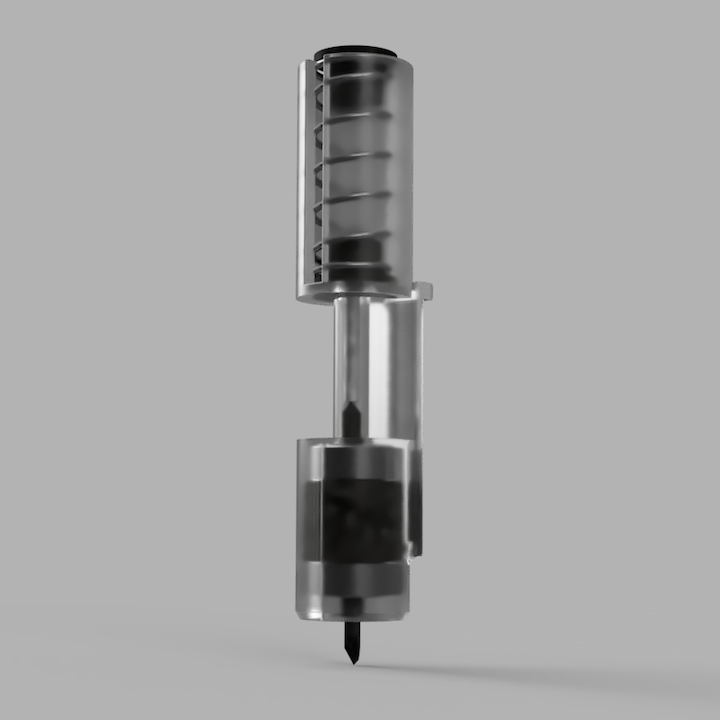
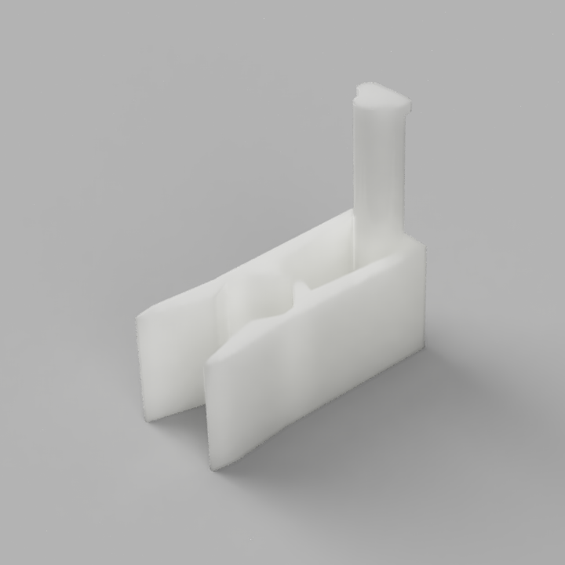
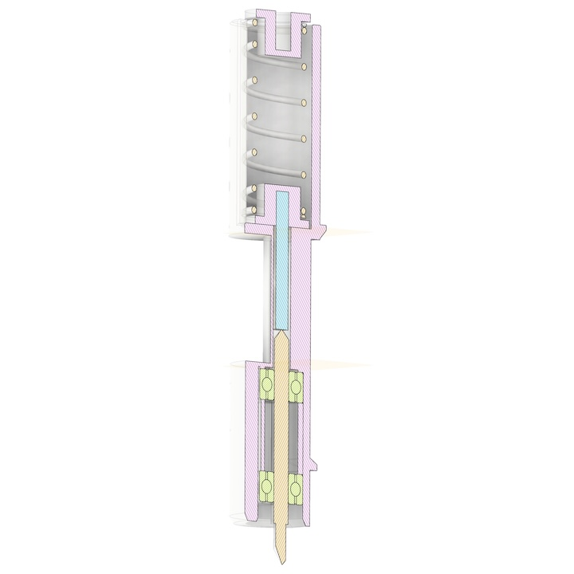
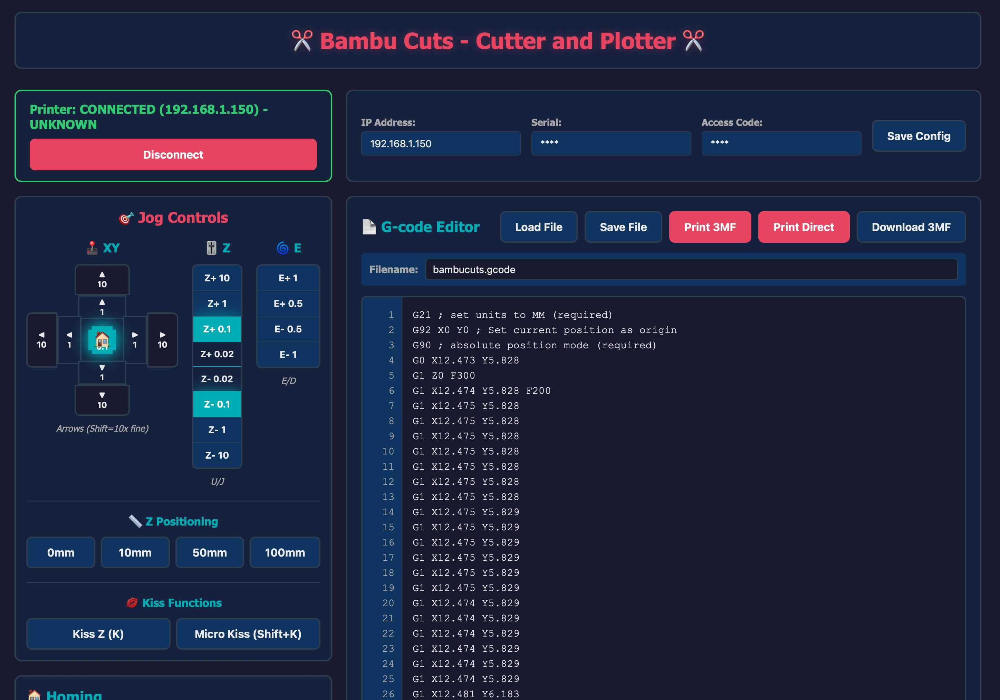

# Bambu Cuts - Cutter and Plotter for Bambu Lab Printers

Control your Bambu Lab 3D printer as a CNC cutter or plotter. Convert SVG/DXF files to G-code and execute them with a web-based control interface.


# WARNING

This can brake your printer, or you, or your cat, or all of the above. Especially if you put a knife on your printer. Using this software there will be no hard limits of the printer movements, make sure your gcode is reasonable. 


The origin of the print is at the current tool head position for X and Y. 
The Z=0 is set with the jogger, always make sure the Z is correctly zeroes. Otherwise it can plunge the knife into the print bed.

The printer needs to be in LAN mode with developer options enabled, or run an older firmware (1.0.4 worked for me)

## TLDR
   ```
   pip install git+https://github.com/unrelatedlabs/bambu-cuts.git
   bambucuts server
   ```

## Demo


*ploting on fabric*


*cutting a sticker with a drag knife*






*3D printed pen holder for plotting operations*


## Assembling the cutter 



Print in PETG! PLA tends to creep more. 

Parts: 
 - 2mm ID 6mm OD 3mm deep bearing 2x. https://amzn.to/46W4Ju7
 - roland style 2mm shaft blades https://amzn.to/4gY9w2Q 
 - 7mm OD, 20mm long spring https://amzn.to/4mQEISK
 - 1.7mm diameter 13mm long steel rod. (I cut a nail to size)
 - a small magnet to hold the blade. I've attached it on the clamp after the cutter is mounted on the printer. 


 The cutter assembly fits in the place of the hot end. Insert to a piece of filament to control the spring tension with the extruder.


## Features




- 🎮 **Web-based Control Interface** - Jog controls, G-code editor, and live monitoring
- ✂️ **SVG/DXF to G-code Conversion** - Convert vector graphics to cutting paths


*Detailed cross-section view of the cutter mechanism*
- 🖥️ **CLI Tools** - Command-line utilities for batch processing


*3D printed pen holder for plotting operations*
- 🔄 **3MF Integration** - Automatically packages G-code for Bambu Lab printers

## Installation

### From Source

```bash
git clone git@github.com:unrelatedlabs/bambu-cuts.git
cd bambu-cuts
pip install -e .
```

## Quick Start

### Option 1: Run Without Installing (Development)

**Quick Start (Linux/Mac):**
```bash
./run.sh
```

**Manual Setup:**
```bash
# Create and activate virtual environment
python3 -m venv .venv
source .venv/bin/activate  # On Windows: .venv\Scripts\activate

# Install dependencies
pip install -r requirements.txt

# Run the server directly
python -m bambucuts.webui.app
```

Open http://localhost:5425 in your browser.

### Option 2: Run with Docker

```bash
# Build the Docker image
docker build -t bambucuts .

# Run the container (interactive for first-time config)
docker run -it -p 5425:5425 bambucuts

# Or run with existing config (non-interactive)
docker run -p 5425:5425 -v ~/.bambucuts.conf:/root/.bambucuts.conf bambucuts
```

**Note:** Use `-it` flag on first run to interactively enter printer configuration. After configuration is saved, you can mount the config file with `-v` flag for subsequent runs.

Open http://localhost:5425 in your browser.

### Option 3: Install and Use CLI

After installation with `pip install -e .`:

```bash
bambucuts server
```

On first run, you'll be prompted for your printer configuration. Configuration is saved to `~/.bambucuts.conf`

Open http://localhost:5425 in your browser.

### 3. Convert SVG to G-code

```bash
bambucuts svg2gcode input.svg -o output.gcode
```

### 4. Convert DXF to SVG

```bash
bambucuts dxf2svg input.dxf -o output.svg
```

## CLI Commands

- `bambucuts server` - Start web interface
- `bambucuts svg2gcode INPUT` - Convert SVG to G-code
- `bambucuts dxf2svg INPUT` - Convert DXF to SVG
- `bambucuts mqtt-dump` - Dump raw Bambu MQTT printer report messages

Run `bambucuts --help` for full options.

## Debugging printer MQTT reports

To inspect the raw status payload from the printer:

```bash
bambucuts mqtt-dump --seconds 5 --count 5
```

The terminal output prints each report as it arrives. To keep listening:

```bash
bambucuts mqtt-dump --follow
```

For machine-readable live output:

```bash
bambucuts mqtt-dump --follow --ndjson
```

When the web server is running, the same dump is also available at:

```bash
curl "http://localhost:5425/api/mqtt-dump?seconds=5&count=5"
```

For streaming newline-delimited JSON:

```bash
curl -N "http://localhost:5425/api/mqtt-stream?seconds=60&count=0"
```

## G-code progress over MQTT

`M73 P<percent> R<remaining>` updates the printer's MQTT progress fields, such as `mc_percent` and `mc_remaining_time`.

When G-code is sent from the web UI, Bambu Cuts appends one done marker after the last command:

```gcode
M400
M73 P43 R0
```

`M400` waits for all queued motion to finish before the `M73` runs, so seeing that exact `mc_percent` with `mc_remaining_time` = 0 in MQTT means the whole batch has completed. The percent is chosen as the printer's current `mc_percent` + 1 so it always produces a fresh MQTT delta. Only a single marker is used, because every `M400` forces the planner to a full stop, which would leave a pen dwell or laser spot at each checkpoint.

`Print Direct` has a `Single call` checkbox. Unchecked (default), each line is published as its own MQTT `gcode_line` command with a 50 ms gap between them. Checked, all lines are joined with newlines and published in a single `gcode_line` command, which is much faster to queue but sends one large MQTT payload the printer may reject if it is too big.

For `Print Direct`, the web UI tracks the active direct job separately. The send action only means the G-code was queued; the job is marked `complete` the moment the MQTT listener sees the final marker, whether or not a browser is polling. While a job is active the listener also sends the printer a `pushall` request twice per second, which keeps the printer emitting a full report about once per second instead of on its own multi-second cadence. The printer never answers faster than once per second however often it is asked, and rates of 10 Hz or more measured slightly slower detection. If the marker does not arrive within the estimated run time × 1.5 (minimum 30 s), the job is marked `stalled`. The estimate sums move distance divided by the modal feed rate plus `G4` dwells, ignoring acceleration. Jobs are queryable at `/api/gcode/jobs` and `/api/gcode/jobs/<id>`.

### Done-signal latency benchmark

To measure how long the done signal takes to arrive after queueing, run the benchmark with the printer connected. Each iteration parks the head at X10 Y10 as its own job, then times a fresh job that moves to X110 Y110 in 1 line and again in 10 lines, and reports min/max/mean/median/stdev for queue time, wait time, and overhead (wait minus estimated motion time):

```bash
curl -X POST http://localhost:5425/api/gcode/benchmark \
  -H 'Content-Type: application/json' \
  -d '{"iterations": 10, "line_counts": [1, 10], "feed_rate": 3000, "single_call": true}'
curl http://localhost:5425/api/gcode/benchmark      # progress and results
curl -X POST http://localhost:5425/api/gcode/benchmark/stop
```

The head must have clear travel between those points and Z is not touched, so lift the pen first. Add `"distance_mm": 0` to make the measured batch a zero-motion move, which isolates the printer's command and reporting latency from motion time.

While a job is active the server log prints one line per MQTT report (`MQTT report +1.850s ...`) with the time since queueing, whether it answered one of our pushalls, and the progress fields it carried. The same timeline is stored per run in the benchmark result under `reports`. Measured on an A1 in September 2026: the printer answers pushall at most once per second however often it is asked, and its status snapshot picks up an executed `M73` about 1 to 2 seconds late, so the done signal trails the end of motion by roughly 0.5 to 3 seconds (median about 1.7 s) and cannot be made faster from the client side.


## My process 

- Create SVG in Inkscape
- create gcode in Kiri:Moto https://grid.space/kiri/  The machine settings for Kiri:Moto are at examples/kirimoto_settings.- I check my gcode with https://ncviewer.com
- In the webui set Z=0 with the jogger
- Move the print head to where the bottom left of the image is supposed to start.
- Load gcode in webui 
- Print 3mf


I use these cutting mats to hold the material https://amzn.to/3Ixn2xJ

## License

### Code License

This software is licensed under the **GNU General Public License v3.0 or later (GPL-3.0-or-later)**.

See [License.txt](License.txt) for the full license text.

You are free to use, modify, and distribute this software under the terms of the GPL-3.0 license.

### 3D Files License

All 3D model files (.3mf, .stl, .obj, etc.) in this repository are licensed under the **Creative Commons Attribution-NonCommercial 4.0 International (CC BY-NC 4.0)**.

See [LICENSE-3D-FILES.txt](LICENSE-3D-FILES.txt) for the full license text.

- ✅ You may share and adapt the 3D files
- ✅ You must give appropriate credit
- ❌ You may not use the 3D files for commercial purposes
